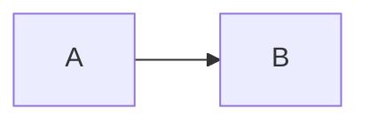

# 주제 이름

> 공부한 날짜: YYYY-MM-DD · 참고 자료: (문서/강의/소스 경로)

## 한 줄 요약

## 핵심 개념

## 내가 이해한 흐름


```mermaid
flowchart LR
  A --> B
```

## 코드로 확인한 것

```cpp
// 엔진 소스 경로: Engine/Source/...
```

## 헷갈렸던 점 / 남은 질문

- [ ]
